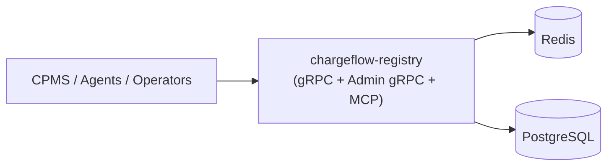

# chargeflow-registry

[](https://github.com/ChargePi/chargeflow-registry/actions/workflows/test.yaml)
[](https://github.com/ChargePi/chargeflow-registry/actions/workflows/lint.yaml)
[](go.mod)
[](LICENSE.md)

A dedicated OCPP schema registry that allows compatibility checks for both CPMS and EV chargers.

OCPP is a standard in name only — every vendor bends it a little. Chargeflow Registry gives you one source of truth for
what "valid" means per version, action, and vendor, so mismatches get caught before they cause a failed charging
session, not after. That matters most at two points that otherwise cost teams real time and money:

- **Integration** — onboarding a new charge point model or CPMS shouldn't mean weeks of manual payload comparison.
  Validate against the registry during integration testing and catch schema drift immediately, instead of debugging it
  in production.
- **Compliance** — OCPP 1.6, 2.0.1, and 2.1 conformance is a moving target, and audits or certification reviews need
  proof, not assurances. A central, versioned registry gives you an auditable record of exactly which schema a given
  vendor/model was validated against.

## Architecture

Chargeflow Registry is a single Go binary exposing three interfaces — a registry gRPC API, an isolated admin gRPC
API, and an MCP server for LLM agents — over one shared service layer, backed by Postgres with a Redis cache in
front of it.



## Deployment

The full stack (Postgres, Redis, migrations, and the app) runs via Docker Compose:

```bash
make docker-up    # build and start the stack
make docker-down  # tear it down
```

The app and its `migrate` companion are container images configured via environment variables, and are equally
suited to running standalone or in a cluster, with migrations applied before the app starts.

## License

This project is licensed under the MIT License - see the [LICENSE](LICENSE.md) file for details.

## Contributing

We welcome contributions to this project! Please read our [contributing guidelines](CONTRIBUTING.md) for more
information on how to get started, and our [Code of Conduct](CODE_OF_CONDUCT.md) before participating.